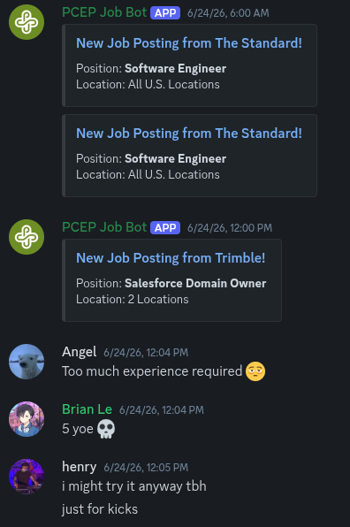

# PCEP Job Board Bot

Just a discord bot for the PCEP server that notifies if a new job is found for the following companies:  
[The Standard](https://standard.wd1.myworkdayjobs.com/Search)  
[Apex Fintech Solutions](https://peak6group.wd1.myworkdayjobs.com/apexfintechsolutions)  
[Trimble](https://trimble.wd1.myworkdayjobs.com/en-US/TrimbleCareers/jobs)  
[Jama Software](https://www.jamasoftware.com/company/careers/#careers)  
[LegitScript](https://www.legitscript.com/about/careers/)  
[CDK Global](https://cdk.wd1.myworkdayjobs.com/en-US/CDK/details/New-Account-Sales-Executive---Vehicle-Inventory-Solutions_JR9158)  
[New Relic](https://newrelic.com/careers)  
[Sphinx](https://job-boards.greenhouse.io/sphinxdefense?gh_src=30d1b1bd8us)  
[General Legal](https://general.legal/careers)  
[Cambia Health Solutions](https://cambiahealth.wd504.myworkdayjobs.com/en-US/External)  
[Concora Credit](https://careers-concoracredit.icims.com/jobs/search)

The bot uses the company's Workday API to fetch job listings, with a scheduled cron job running hourly on weekdays from 6 AM to 12 PM to look for any newly posted jobs. It also webscrapes for companies that don't use workday APIs (like Greenhouse for example).  

I'm slowly adding more companies soon! If you want to suggest a company, feel free to create a request on the [Issues](https://github.com/ricer0ll/pcep-job-board/issues) section.  

*Here's my Raspberry Pi that runs the Discord bot 24/7 on the PCEP discord server!*

  
*Jobs being notified by the bot*

## Contributing
Contributions are also welcomed! Here are the services and their tech stack:  
**Discord Bot**: Discord bot written in Golang, using [DisGo Library](https://github.com/disgoorg/disgo).  
**Jobs DB Service**: A backend service to communicate to PostgreSQL database, written in Java using Springboot.  
**Webscraper**: A microservice to scrape jobs from Greenhouse and RipplerATS, written in Python using FastAPI & Playwright.

## Running Locally
You may also run this bot locally on your machine using your own Discord Bot Token and can specify which channel to send notifications to. Create a copy of the `.env.example`, name it `.env` and replace the values.  

Start the docker container with:  
`$ docker compose up -d --build`  

To stop the container, run:  
`$ docker compose down -v`
